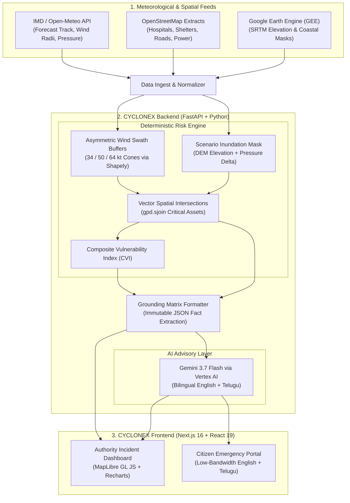

# CYCLONEX 🌀

> **AI-Assisted Geospatial Decision-Support Platform for Pre-Landfall Cyclone Risk and Critical-Infrastructure Assessment**

[](https://fastapi.tiangolo.com)
[](https://nextjs.org)
[](https://python.org)
[](https://geopandas.org)
[](LICENSE)

---

## 1. Executive Summary & Resume Positioning

CYCLONEX is an AI-assisted geospatial decision-support platform designed to assist disaster management authorities (State & District Disaster Management Authorities - SDMA/DDMA) and coastal communities in evaluating hazard exposure hours before cyclone landfall.

### The Engineering Grounding Guarantee
- **Deterministic Math First**: Numerical risk metrics, wind hazard cones, coastal inundation envelopes, and critical-infrastructure spatial intersections (`gpd.sjoin`) are computed deterministically using **NumPy, Pandas, GeoPandas, and Shapely**.
- **Zero Generative Hallucination**: **Gemini 3.7 Flash (Vertex AI)** receives an immutable JSON matrix of deterministic calculations. It is strictly constrained from calculating or inventing risk numbers, acting purely as an operational narrative synthesizer and bilingual advisory generator.
- **Honest Modeling Boundaries**: Storm surge is modeled as an explainable **scenario-based terrain & tidal elevation simulation** using Google Earth Engine (SRTM/NASADEM coastal topography) and central pressure drop, rather than an unvalidated hydrodynamic partial differential equation (PDE) solver.
- **Bilingual Emergency Communication**: Features dual portals—a deep **Authority Incident Dashboard** and an ultra-lightweight, high-contrast **Citizen Safety Portal** localized in both **English and Telugu (తెలుగు)**.

---

## 2. High-Level Architecture



---

## 3. Monorepo Structure

```
cyclonex/
├── backend/
│   ├── app/
│   │   ├── api/
│   │   │   ├── v1/
│   │   │   │   ├── endpoints/
│   │   │   │   │   └── health.py          # GET /api/v1/health (Stack & mode verification)
│   │   │   │   └── router.py              # Root API v1 router
│   │   ├── core/
│   │   │   ├── config.py                  # Pydantic Settings & environment parsing
│   │   │   └── logging.py                 # Structured logging utility
│   │   ├── engine/                        # [Milestone 2] Deterministic hazard & risk engine
│   │   ├── geospatial/                    # [Milestone 3/4] GEE raster & OSM vector loaders
│   │   ├── providers/                     # [Milestone 3] Weather adapters & benchmarks
│   │   ├── ai/                            # [Milestone 4] Gemini 3.7 Flash grounding client
│   │   ├── schemas/                       # Pydantic response & DTO schemas
│   │   └── main.py                        # FastAPI application & CORS configuration
│   ├── tests/
│   │   ├── conftest.py                    # TestClient fixtures
│   │   └── test_health.py                 # Health and stack integrity test suite
│   ├── requirements.txt                   # Pinned backend dependencies
│   └── .env.example                       # Backend environment template
├── frontend/
│   ├── src/
│   │   ├── app/
│   │   │   ├── layout.tsx                 # Root layout with dark mode & typography
│   │   │   ├── globals.css                # Tailwind CSS v4 directives
│   │   │   └── page.tsx                   # Interactive landing & live health probe
│   │   ├── lib/
│   │   │   └── api.ts                     # Typed fetch client for backend API
│   │   └── types/
│   │       └── health.ts                  # TypeScript response contracts
│   ├── package.json                       # Next.js 16, React 19, MapLibre, Recharts
│   └── .env.example                       # Frontend environment template
├── .gitignore                             # Unified ignore rules
└── README.md                              # Project documentation
```

---

## 4. Prerequisites

Before running CYCLONEX locally, ensure you have:
- **Python**: Version 3.12, 3.13, or 3.14 (64-bit).
- **Node.js**: Version 20.x, 22.x, or 24.x (`npm` v10+).
- **Git**: Installed and available in your system path.
- **Operating System**: Windows, macOS, or Linux.

---

## 5. Local Setup Instructions

### 5.1 Clone & Navigate
```bash
git clone <your-repo-url> cyclonex
cd cyclonex
```

### 5.2 Backend Setup (Python + FastAPI)

1. **Create and activate a virtual environment**:
   ```powershell
   # Windows (PowerShell)
   cd backend
   python -m venv .venv
   .\.venv\Scripts\Activate.ps1
   ```
   ```bash
   # macOS / Linux
   cd backend
   python3 -m venv .venv
   source .venv/bin/activate
   ```

2. **Install dependencies**:
   ```bash
   pip install --upgrade pip
   pip install -r requirements.txt
   ```

3. **Configure environment variables**:
   ```bash
   # Copy configuration template
   cp .env.example .env
   ```

4. **Run backend verification tests**:
   ```bash
   pytest -v
   ```

5. **Start the FastAPI backend**:
   ```bash
   uvicorn app.main:app --reload --port 8000
   ```
   The backend will be available at:
   - Interactive Swagger API Docs: `http://localhost:8000/api/v1/docs`
   - ReDoc Documentation: `http://localhost:8000/api/v1/redoc`
   - Health Check: `http://localhost:8000/api/v1/health`

### 5.3 Frontend Setup (Next.js 16 + React 19)

1. **Open a new terminal and navigate to frontend**:
   ```bash
   cd cyclonex/frontend
   ```

2. **Configure environment variables**:
   ```bash
   cp .env.example .env.local
   ```

3. **Install dependencies**:
   ```bash
   npm install
   ```

4. **Run the production build check**:
   ```bash
   npm run build
   ```

5. **Start the development server**:
   ```bash
   npm run dev
   ```
   Open `http://localhost:3000` in your browser. The landing page will automatically probe `http://localhost:8000/api/v1/health` and display live deterministic stack status.

---

## 6. Environment Variables Reference

### Backend (`backend/.env`)

| Variable | Default | Description |
| :--- | :--- | :--- |
| `ENVIRONMENT` | `development` | Deployment environment (`development` / `production`). |
| `DEBUG` | `True` | FastAPI debug mode flag. |
| `HOST` | `0.0.0.0` | Bind host address. |
| `PORT` | `8000` | Port for the backend API. |
| `CORS_ORIGINS` | `["http://localhost:3000"]` | Allowed origins for cross-origin browser requests. |
| `DATA_SOURCE_MODE` | `simulated` | Data mode: `simulated` (benchmarks) or `live` (APIs). |
| `DEFAULT_BENCHMARK_SCENARIO` | `cyclone_michaung_2023` | Default benchmark dataset for offline simulation. |
| `GOOGLE_CLOUD_PROJECT` | `""` | GCP Project ID for Vertex AI (Milestone 4). |
| `VERTEX_AI_LOCATION` | `us-central1` | Region for Gemini 3.7 Flash on Vertex AI. |
| `GEE_PROJECT_ID` | `""` | Google Earth Engine project ID (Milestone 4). |

### Frontend (`frontend/.env.local`)

| Variable | Default | Description |
| :--- | :--- | :--- |
| `NEXT_PUBLIC_API_BASE_URL` | `http://localhost:8000` | FastAPI server URL. |
| `NEXT_PUBLIC_DEFAULT_LOCALE` | `en` | Default UI localization (`en` or `te`). |
| `NEXT_PUBLIC_MAP_STYLE` | `https://demotiles.maplibre.org/style.json` | Vector tile stylesheet URL for MapLibre GL. |

---

## 7. Real vs. Simulated Boundaries

In accordance with scientific and engineering honesty standards:
- **REAL**:
  - Live system health checks, dependency versions, and Pydantic schema validation.
  - Spatial joins, coordinate math, vector buffer geometry (`gpd.sjoin`), and Composite Vulnerability Index formulas.
- **SIMULATED / SCENARIO-BASED**:
  - Storm surge is strictly identified as a **pre-landfall terrain and elevation scenario simulation** based on coastal DEM elevation thresholds and central pressure drops, not a hydrodynamic PDE wave-action solver.
  - When external API credentials (GEE, Vertex AI) are absent or in offline testing, verified historical reference datasets (*Cyclone Michaung 2023* and *Cyclone Hudhud 2014*) are utilized and watermarked with `[SIMULATED SCENARIO BENCHMARK]`.

---

## 8. Milestone Roadmap

- [x] **Milestone 1: Project Scaffolding & Monorepo Foundation**
  - Git repository initialized.
  - Monorepo layout (`/backend`, `/frontend`, `/README.md`).
  - FastAPI backend with CORS, Pydantic settings, health check, and pytest suite.
  - Next.js 16 + React 19 + TypeScript + Tailwind CSS frontend with live API probe.
  - Locked dependency freeze and verified zero-error build.
- [ ] **Milestone 2: Deterministic Hazard & Risk Engine**
  - Parametric asymmetric wind swath buffer generator (34, 50, 64 kt cones via Shapely).
  - Pre-landfall coastal surge scenario inundation mask (DEM elevation + pressure delta).
  - GeoPandas critical infrastructure spatial join engine.
  - Composite Vulnerability Index (CVI) calculation with transparent formulas.
  - Pytest unit tests for all mathematical formulas.
- [ ] **Milestone 3: Data Ingestion & Benchmark Datasets**
  - Abstract data provider interfaces.
  - Live meteorological adapter (Open-Meteo / IMD Bulletins).
  - Verified historical benchmark datasets (Michaung 2023 / Hudhud 2014).
  - OpenStreetMap (OSM) infrastructure ingestion for coastal districts.
- [ ] **Milestone 4: Google Earth Engine & Grounded Gemini Advisory**
  - GEE Python client for coastal terrain and elevation profiles.
  - Vertex AI Gemini 3.7 Flash integration with strict JSON grounding contract.
  - Bilingual advisory generation (English + Telugu emergency alerts).
- [ ] **Milestone 5: Interactive Visual Portals**
  - Authority Incident Dashboard with MapLibre GL JS vector layers.
  - Recharts exposure breakdown and timeline charts.
  - Low-bandwidth Citizen Safety View with safe shelter locator.
- [ ] **Milestone 6: Packaging, Deployment & Documentation**
  - Cloud Run containerization with GDAL/GEOS Dockerfile.
  - Full end-to-end deployment verification.
  - Interview defense cheat sheet and video walkthrough documentation.
