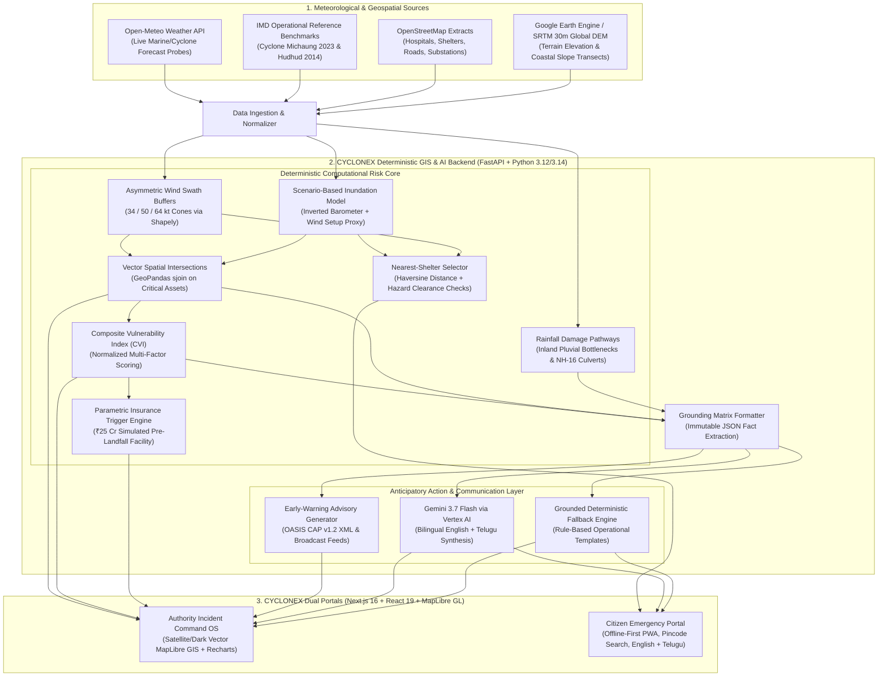

# CYCLONEX 🌀

> **AI-Powered Geospatial Decision-Support Platform for Pre-Landfall Cyclone Risk, Critical-Infrastructure Vulnerability & Anticipatory Action**

[](https://cyclonex-frontend-production.up.railway.app/)
[](https://cyclonex-backend-production.up.railway.app/api/v1/health)
[](backend/tests/)
[](frontend/)
[](https://python.org)
[](https://geopandas.org)
[](https://maplibre.org)
[](LICENSE)

---

## Live Prototype Deployment

| Service | Public URL | Description |
| :--- | :--- | :--- |
| **Frontend Web App** | [cyclonex-frontend-production.up.railway.app](https://cyclonex-frontend-production.up.railway.app/) | Authority Incident Command OS & Citizen Emergency Portal |
| **Backend Telemetry** | [cyclonex-backend-production.up.railway.app/api/v1/health](https://cyclonex-backend-production.up.railway.app/api/v1/health) | Deterministic risk engine health check & active Python stack verification |
| **Interactive API Docs**| [cyclonex-backend-production.up.railway.app/docs](https://cyclonex-backend-production.up.railway.app/docs) | Interactive OpenAPI/Swagger documentation for all GIS & advisory endpoints |

> **Deployment Architecture Note**: The current public prototype is deployed on Railway using multi-stage container builds. The codebase includes production Dockerfiles configured with required C-libraries (GDAL, GEOS, PROJ) for portable deployment across modern container environments, including Google Cloud Run.

---

## 1. Executive Summary & Problem Framing

### The Core Problem: The Cascading Failure Gap
Extreme weather events in the Bay of Bengal and coastal APAC routinely cause devastating loss of life and livelihoods. While modern meteorological agencies provide increasingly accurate track cones, disaster management authorities (State and District Disaster Management Authorities — SDMA/DDMA) face a critical operational gap: **hazard forecasts alone do not tell commanders what fails next.**

```
CYCLONE APPROACHING ➔ 🌧️ HEAVY RAINFALL ➔ 🌊 STORM SURGE ➔ 🛣️ ARTERIAL WASHOUT ➔ 🏥 HOSPITAL ACCESS CUT ➔ 🚨 EMERGENCY RESPONSE DELAY
```

> **The CYCLONEX Paradigm**: *The operational challenge isn't merely predicting the cyclone; it is predicting cascading infrastructure failure pathways and triggering anticipatory action 36–48 hours before landfall.*

### Core Value Proposition
```
FORECAST  ➔  IMPACT  ➔  CASCADE  ➔  ACTION
```
* **Know What the Cyclone Could Break — Before It Does**: AI-powered pre-landfall risk intelligence for infrastructure hardening, arterial route preservation, and parametric liquidity triggers.
* **Forecast**: Synthesizes verified atmospheric tracks and barometric pressures.
* **Impact**: Intersects parametric wind cones and scenario surge inundation envelopes against critical infrastructure vectors (power grids, highways, designated shelters).
* **Cascade**: Models compound pluvial drainage bottlenecks, arterial highway culvert washouts (NH-16, SH-42), and power substation flood-locking.
* **Action**: Generates Common Alerting Protocol (CAP v1.2) compliant emergency dispatches, hazard-cleared citizen shelter directions, and simulated pre-landfall parametric insurance liquidity triggers.

### Core Engineering Guarantees
1. **Deterministic Ground Truth First**: All numerical metrics—wind hazard buffer cones, coastal surge inundation envelopes, spatial asset intersections (`gpd.sjoin`), arterial culvert drainage vulnerabilities, and Composite Vulnerability Index (CVI) scores—are computed deterministically using **NumPy, Pandas, GeoPandas, and Shapely**.
2. **Strictly Grounded Generative AI**: **Gemini 3.7 Flash (Vertex AI)** receives an immutable JSON ground truth matrix produced by the deterministic risk engine. All numerical hazard metrics, exposure counts, and flood elevations are calculated strictly outside the LLM. Gemini acts as an operational narrative synthesizer and bilingual advisory generator, with prompt directives constraining it from inventing numerical metrics. (While generative LLMs cannot be theoretically guaranteed to have zero hallucinations in unconstrained environments, our architecture strictly grounds all numerical output in deterministic calculations.)
3. **Honest Modeling Boundaries**: Storm surge modeling is **scenario-based** and informed by established coastal surge methodologies and the inverted-barometer relationship. It combines coastal DEM elevation thresholds with central pressure drop and wind setup proxies for pre-landfall vulnerability screening and decision support—explicitly **not** a calibrated hydrodynamic partial differential equation (PDE) solver or engineering-grade flood-boundary prediction.
4. **Bilingual Regional Emergency Communication**: Dual experiences—a deep **Authority Incident Command OS** for disaster commanders and an ultra-lightweight, high-contrast **Citizen Emergency Portal** localized in **English and Telugu (తెలుగు)** with a nearest-shelter selector with hazard clearance checks.
5. **Simulated Parametric Disaster Facility**: Models a **₹25 Cr simulated pre-landfall liquidity trigger** across multi-tier parametric tranches, demonstrating how anticipatory relief capital can be disbursed before landfall rather than relying on delayed post-disaster indemnity assessments.

---

## 2. High-Level Architecture



---

## 3. Monorepo Structure

```
cyclonex/
├── backend/
│   ├── app/
│   │   ├── api/v1/endpoints/
│   │   │   ├── health.py              # GET /api/v1/health (Deterministic stack & health probe)
│   │   │   ├── cyclone.py             # GET /api/v1/cyclone (Active & historical benchmark tracks)
│   │   │   ├── infrastructure.py      # GET /api/v1/infrastructure (GeoJSON assets & shelter query)
│   │   │   ├── risk_analysis.py       # POST /api/v1/risk/evaluate (Spatial join & CVI pipeline)
│   │   │   └── advisory.py            # POST /api/v1/advisory/generate (Grounded bilingual AI advisories)
│   │   ├── core/
│   │   │   ├── config.py              # Pydantic Settings & environment variables
│   │   │   └── logging.py             # Structured application logging
│   │   ├── engine/                    # Deterministic computational physics & risk modules
│   │   │   ├── wind_field.py          # Asymmetric wind swath buffer generator (Shapely)
│   │   │   ├── surge_scenario.py      # Scenario-based coastal surge simulation (Inverted Barometer)
│   │   │   ├── spatial_join.py        # Vector spatial intersections via GeoPandas (gpd.sjoin)
│   │   │   ├── rainfall_pathways.py   # Pluvial drainage accumulation & highway culvert washout risk
│   │   │   ├── cvi_calculator.py      # Composite Vulnerability Index formula & severity ranking
│   │   │   ├── shelter_allocator.py   # Nearest-shelter selector with hazard clearance checks
│   │   │   ├── parametric_insurance.py# Parametric disaster insurance trigger engine (₹25 Cr simulated)
│   │   │   └── dispatch_generator.py  # OASIS CAP v1.2 XML & multi-channel broadcast generator
│   │   ├── geospatial/
│   │   │   ├── gee_client.py          # Google Earth Engine client with SRTM 30m benchmark matrix
│   │   │   └── osm_loader.py          # Coastal Andhra Pradesh OpenStreetMap infrastructure vectors
│   │   ├── providers/
│   │   │   ├── base.py                # Abstract data provider contracts
│   │   │   ├── live_weather.py        # Open-Meteo live API probe adapter
│   │   │   └── simulated_benchmarks.py# Cyclone Michaung (2023) & Hudhud (2014) benchmark archives
│   │   ├── ai/
│   │   │   ├── vertex_gemini.py       # Gemini 3.7 Flash grounding client & fallback
│   │   │   └── prompt_templates.py    # Strict grounding prompt directives (zero numerical hallucination)
│   │   └── main.py                    # FastAPI application, CORS & router registration
│   ├── tests/                         # Complete Pytest test suite (24/24 tests passing)
│   ├── Dockerfile                     # Multi-stage container with GDAL, GEOS, PROJ C-libraries
│   ├── requirements.txt               # Pinned backend dependencies
│   ├── railway.toml                   # Railway container deployment configuration
│   └── .env.example                   # Backend environment template
├── frontend/
│   ├── src/
│   │   ├── app/
│   │   │   ├── layout.tsx             # Root layout with dark mode theme & metadata
│   │   │   ├── page.tsx               # Main clean landing page (Authority & Citizen portal cards)
│   │   │   ├── authority/page.tsx     # Authority Incident Command OS (GIS, Analytics, Dispatches)
│   │   │   └── citizen/page.tsx       # Low-bandwidth Bilingual Citizen Safety View (Pincode Search)
│   │   ├── components/
│   │   │   ├── map/MapContainer.tsx   # GPU-accelerated MapLibre GL JS (Satellite & Dark Basemaps)
│   │   │   ├── analytics/ExposureCharts.tsx # Recharts exposure matrices & CVI district ranking
│   │   │   ├── EmergencyBanner.tsx    # Unified IMD category & hazard alert banner
│   │   │   ├── ExecutiveActionStrip.tsx # Tactical incident commander directives & status
│   │   │   └── Sidebar.tsx            # Accessible navigation sidebar with tooltips
│   │   ├── lib/
│   │   │   ├── api.ts                 # Typed fetch client with dynamic runtime API URL resolution
│   │   │   ├── i18n.ts                # Synchronized English & Telugu (తెలుగు) emergency dictionary
│   │   │   └── severity.ts            # Normalized CVI threshold & severity classification helper
│   │   └── types/                     # TypeScript data contracts & interfaces
│   ├── Dockerfile                     # Production Next.js 16 container with dynamic PORT routing
│   ├── package.json                   # Next.js 16, React 19, MapLibre GL, Recharts, Tailwind CSS
│   ├── railway.toml                   # Railway frontend deployment configuration
│   └── .env.example                   # Frontend environment template
├── railway.toml                       # Root Railway configuration
├── render.yaml                        # Render.com deployment manifest
├── vercel.json                        # Vercel deployment configuration
├── docker-compose.yml                 # 1-command local deployment
└── README.md                          # Project documentation & competition overview
```

---

## 4. Deterministic Risk Engine: Formulas & Mathematics

Every calculation in CYCLONEX is explainable from first principles:

### 4.1 Hazard Envelope Buffering (Shapely)
Given cyclone trajectory waypoints $P_i = (\text{lat}_i, \text{lon}_i, t_i, V_{\text{max}, i}, R_{34}, R_{50}, R_{64})$:
- Swaths are constructed via directional polygon buffers and convex hulls along track line segments:
  $$\Omega_{\text{hazard}} = \bigcup_i \text{ConvexHull}(\text{Buffer}(P_i, R_V), \text{Buffer}(P_{i+1}, R_V))$$
- Categorized by nautical force thresholds following international meteorological standards: Gale ($34\,\text{kt} \approx 63\,\text{km/h}$), Storm ($50\,\text{kt} \approx 93\,\text{km/h}$), and Hurricane ($64\,\text{kt} \approx 119\,\text{km/h}$).

### 4.2 Scenario-Based Coastal Inundation Simulation
Storm surge modeling in CYCLONEX is **scenario-based** and informed by established coastal surge methodologies and the inverted-barometer relationship. It is engineered for rapid pre-landfall screening and decision support, rather than engineering-grade flood-boundary prediction:

$$h_{\text{surge\_scenario}} = \Delta h_{\text{pressure}} + \Delta h_{\text{wind}} + h_{\text{tide}}$$

- **Inverted Barometer Effect**:
  $$\Delta h_{\text{pressure}} = \max\left(0.0,\, 0.01 \times (1013.25 - P_{\text{central\_hPa}})\right)\,\text{meters}$$
  *(Represents hydrostatic sea-surface elevation response of approximately 1 cm water rise per 1 hPa pressure drop).*
- **Wind Setup Proxy**:
  $$\Delta h_{\text{wind}} = \alpha \times \left(\frac{V_{\max}}{100}\right)^{1.8}$$
  *(Where $\alpha \approx 1.15$ models the shallow, gently sloping coastal shelf of the Krishna-Godavari Bay of Bengal interface).*
- **Scenario Inundation Reach**:
  $$\text{Reach}_{\text{km}} = \min\left(25.0,\, \max\left(2.0,\, \frac{h_{\text{surge\_scenario}}}{\text{Slope}_{\text{coastal}}}\right)\right)$$
  *(Where $\text{Slope}_{\text{coastal}} \approx 0.35\,\text{m/km}$ based on Google Earth Engine SRTM 30m digital elevation transects).*

### 4.3 Composite Vulnerability Index (CVI)
For any administrative district or ward $k$, CVI is computed from normalized component scores using fixed weighted factors, with the final score bounded strictly to $[0.0, 1.0]$:

$$\text{CVI}_k = \max\left(0.0,\, \min\left(1.0,\, w_w \cdot \overline{V}_{\text{wind}, k} + w_s \cdot S_{\text{surge}, k} + w_e \cdot (1 - \overline{E}_k) + w_i \cdot I_{\text{density}, k} - w_c \cdot C_{\text{shelter}, k}\right)\right)$$

- **Component Normalization**:
  - $\overline{V}_{\text{wind}} = \min(1.0,\, V_{\max} / 170.0)$
  - $S_{\text{surge}} = \text{clamp}(\text{inundated\_area\_fraction},\, 0.0,\, 1.0)$
  - $\overline{E}_k = \min(1.0,\, \text{elevation}_{\text{mean}} / 30.0) \implies \text{Elevation Deficit Risk} = 1 - \overline{E}_k$
  - $I_{\text{density}} = \min(1.0,\, \text{critical\_assets\_count} / 15.0)$
  - $C_{\text{shelter}} = \text{clamp}(\text{shelter\_capacity\_ratio},\, 0.0,\, 1.0)$
- **Fixed Model Weights**:
  $w_w = 0.35$ (Peak Wind), $w_s = 0.35$ (Surge Inundation), $w_e = 0.15$ (Low Elevation Risk), $w_i = 0.15$ (Infrastructure Density), $w_c = 0.05$ (Shelter Capacity Mitigation).
- **Severity Classification**:
  - **Low**: $< 0.30$ (Routine monitoring)
  - **Moderate**: $0.30 – 0.499$ (Restrict movement, secure coastal assets)
  - **High**: $0.50 – 0.699$ (Prepare designated shelters, evacuate vulnerable habitations)
  - **Extreme**: $\ge 0.70$ (Immediate mandatory coastal evacuation, utility load-isolation)

### 4.4 Nearest-Shelter Selector with Hazard Clearance Checks (Haversine Distance)
Citizen shelter proximity is calculated using geodesic great-circle distance:

$$d = 2R \arcsin\left(\sqrt{\sin^2\left(\frac{\Delta \phi}{2}\right) + \cos(\phi_1)\cos(\phi_2)\sin^2\left(\frac{\Delta \lambda}{2}\right)}\right)$$

- **Hazard Clearance Protocol**: Each registered shelter candidate is tested geometrically against active surge inundation polygons and 64-kt hurricane wind cones using Shapely point-in-polygon containment (`Point(lon, lat)`).
- Shelters located outside the active surge envelope are prioritized as safe and operational; compromised facilities are clearly flagged with hazard warnings in both English and Telugu.

### 4.5 Anticipatory Parametric Insurance Liquidity Facility (₹25 Cr Simulated)
To demonstrate anticipatory financing, the engine models a multi-tranche parametric payout facility triggered by pre-landfall deterministic metrics rather than post-disaster loss assessments:
- **Tranche 1 (50-kt Gale Evacuation)**: ₹15.0 Cr triggered when peak sustained winds exceed 93 km/h (50 kt).
- **Tranche 2 (64-kt Hurricane Hardening)**: ₹20.0 Cr triggered when peak sustained winds exceed 118.5 km/h (64 kt).
- **Tranche 3 (Coastal Surge Inundation)**: ₹10.0 Cr triggered when scenario surge height reaches $\ge 2.0\,\text{m}$.
- **Tranche 4 (Compound Pluvial Drainage Risk)**: ₹5.0 Cr triggered when 24h rainfall $\ge 200\,\text{mm}$ and CVI $\ge 0.70$.
*(In the historical benchmark of Cyclone Michaung with 110 km/h winds and 2.2m surge, Tranches 1 & 3 activate, releasing **₹25.0 Cr simulated pre-landfall liquidity** for rapid municipal evacuation transit and food security).*

---

## 5. Local Setup Instructions

### 5.1 Prerequisites
- **Python**: Version 3.12, 3.13, or 3.14 (64-bit)
- **Node.js**: Version 20.x, 22.x, or 24.x (`npm` v10+)
- **Git**

### 5.2 Backend Setup (FastAPI)
```powershell
# Windows (PowerShell)
cd backend
python -m venv .venv
.\.venv\Scripts\Activate.ps1
pip install --upgrade pip
pip install -r requirements.txt
cp .env.example .env

# Run full verification test suite (24 tests)
pytest -v

# Start FastAPI development server
uvicorn app.main:app --reload --host 0.0.0.0 --port 8000
```
Backend API will be live at `http://localhost:8000` with interactive Swagger docs at `http://localhost:8000/docs`.

### 5.3 Frontend Setup (Next.js 16)
```bash
# In a new terminal window
cd frontend
cp .env.example .env.local
npm install
npm run build
npm run dev
```
Open **`http://localhost:3000`** in your browser.

### 5.4 Docker Deployment
```bash
# Build and run containers locally with Docker Compose
docker-compose up --build
```

---

## 6. How to Give a 3–4 Minute Hackathon Presentation

Follow this structured, competition-tested narrative matching the 6-slide showcase deck:

1. **The Hook & Problem (0:00 – 0:45) — [Slide 1: What is CYCLONEX?]**:
   - *"Hours before a cyclone makes landfall, disaster response agencies don't need generic track forecasts; they need to know what fails next: Which 132kV substations will flood? Which NH-16 culverts will wash out? Which coastal hamlets need immediate mandatory evacuation? CYCLONEX shifts disaster management from delayed post-landfall relief to 36–48h anticipatory action."*
   - Show the clean landing page with Authority and Citizen portals.
2. **From Forecast to Decision (0:45 – 1:30) — [Slide 2: How It Works]**:
   - Open `/authority` (Authority Incident Command OS).
   - Point to the **What Differentiates CYCLONEX** story: Most tools visualize hazard; CYCLONEX connects `Forecast ➔ Impact ➔ Cascade ➔ Action`.
   - Toggle basemaps between **🛰️ Satellite (ESRI World Imagery)** and **🗺️ Dark Canvas**.
   - Note the stationary, anchor-centered infrastructure pins showing power substations, hospitals, and highways with deterministic hazard badges.
3. **The Engineering Pipeline & Grounded AI (1:30 – 2:15) — [Slide 3 & 4: Technical Rigor]**:
   - Explain the 4-stage pipeline: Ingestion (GEE SRTM 30m, Sentinel SAR, OSM) ➔ Physics (Inverted Barometer, wind swaths) ➔ Prediction (substation flood-locking, NH-16 washout) ➔ Action (CAP v1.2 alerts).
   - Scroll to the **Tactical Directives**: *"The numerical metrics shown in this briefing originate from our deterministic GeoPandas risk engine and are passed to Gemini 3.7 Flash as verified JSON. The LLM synthesizes operational narratives; it never invents numbers."*
   - Highlight real disaster resilience: Offline-first PWA caching (<50KB), deterministic ground-truth boundary, and full English + Telugu localization.
4. **Impact & Anticipatory Financing (2:15 – 3:00) — [Slide 5: Quantifiable Impact]**:
   - Show the **₹25.0 Cr Simulated Parametric Liquidity Facility**: Explain how parametric triggers (50 kt wind + 2.0m surge) release capital pre-landfall for municipal evacuation transport and relief, bypassing post-disaster delays.
   - Inspect the **Alerts & Dispatches Console**: Show OASIS CAP v1.2 XML generation ready for NDMA SACHET and APSDMA gateways.
5. **Citizen Emergency Experience & Benchmark Scenarios (3:00 – 3:45) — [Slide 6: Grounded in Science]**:
   - Switch to `/citizen`.
   - Demonstrate the citizen-friendly search: type a town name (*Chirala*) or PIN code (*522101*) without needing raw GPS coordinates.
   - Switch language to **తెలుగు (Telugu)** to show synchronized regional language support.
   - Click a shelter card: show the **Nearest-Shelter Selector** calculating distance, compass direction, and safety clearance, complete with one-tap Google Maps directions and emergency call buttons (1070 / 112).
   - Conclude with the scientific grounding: SLOSH concepts, Gornitz 1994 CVI, and verified benchmarks for Cyclone Michaung (2023) and Cyclone Hudhud (2014).

---

## 7. What Claims Are Safe to Make on Your Resume

| What You CAN Honestly Claim | What You Should NOT Claim |
| :--- | :--- |
| **"Coupled GeoPandas and Shapely deterministic hazard buffering with Google Vertex AI Gemini 3.7 Flash for pre-landfall cyclone decision support."** | ❌ *"Trained a deep learning model that predicts cyclone tracks more accurately than the weather department."* |
| **"Implemented an explainable scenario-based storm surge inundation model using inverted barometric pressure drop and coastal DEM elevation."** | ❌ *"Built a calibrated hydrodynamic partial differential equation (PDE) solver (like operational SLOSH or ADCIRC)."* |
| **"Enforced strictly grounded AI by passing verified spatial JSON matrices to Gemini 3.7 Flash and asserting numerical integrity outside the LLM."** | ❌ *"Guaranteed that a generative LLM can never hallucinate in unconstrained settings."* |
| **"Engineered an offline-first bilingual emergency response portal in English and Telugu with GPU-accelerated MapLibre GL JS vector/satellite tiles and a nearest-shelter selector."** | ❌ *"Built a full graph-network road routing engine or live-monitored IoT sensors inside all hospitals."* |
| **"Modeled a simulated ₹25 Cr pre-landfall parametric insurance liquidity trigger engine to demonstrate anticipatory disaster financing."** | ❌ *"Executed live banking/insurance capital transactions with financial institutions."* |
| **"Constructed an OASIS CAP v1.2 XML emergency dispatch generator producing broadcast-ready payloads for emergency authorities."** | ❌ *"Sent real SMS or telecom cell broadcasts to Indian telecom networks."* |

---

## 8. Verification Results

CYCLONEX has undergone end-to-end automated and browser verification:

- **Backend Pytest Suite**: **24/24 tests passed** (100% pass rate in 0.32s) covering CVI formulas, wind swaths, surge polygons, parametric triggers, rainfall damage pathways, and dispatch generators.
- **Frontend Turbopack Build**: Next.js 16 production build compiled successfully with strict TypeScript validation.
- **Headless Browser Audit (Puppeteer E2E)**:
  - **Cyclone Michaung Scenario**: Verified Severe Cyclonic Storm (SCS) at 110 km/h with 2.2m surge.
  - **Live Cat 5 Simulation Scenario**: Verified Super Cyclonic Storm (SuCS) at 235 km/h with 6.83m surge without unhandled exceptions.
  - **Cyclone Hudhud Scenario**: Verified Extremely Severe Cyclonic Storm (ESCS) at 185 km/h with 4.61m surge.
  - **GIS Map Layers & Basemaps**: Verified ESRI Satellite raster tiles, Dark Canvas vector layers, 34/50/64-kt wind buffer swaths, coastal surge envelopes, and stationary infrastructure markers.
  - **Marker Stability**: Confirmed 0.00px hover drift and intact marker instances upon popup interaction.
  - **Citizen Natural Search**: Verified instant autocomplete by habitation name (*Chirala*) and PIN code (*522101*).
  - **Bilingual & State Preservation**: Verified Telugu-to-English dynamic error updates, non-zero shelter distances, and sticky emergency call bar.
  - **Browser Console Errors during Audit**: **0 errors**.

---

## 9. Research Foundations & Methodological References

1. **India Meteorological Department (IMD)**: Standard Operating Procedures for Cyclone Warning in India, RSMC New Delhi Operational Bulletins, and IBTrACS Best Track Archives.
2. **Inverted Barometer Formulation**: Hydrostatic sea-surface response to atmospheric pressure drop: $\Delta\eta = \Delta P / (\rho \cdot g)$ applied over coastal bathymetry.
3. **Coastal Vulnerability Index (CVI)**: Gornitz, V. et al. (1994), *Vulnerability of the U.S. coast to future sea-level rise*, Coastal Education & Research Foundation.
4. **Shuttle Radar Topography Mission (SRTM)**: NASA / USGS 30m Global Digital Elevation Model (SRTMGL1_003) via Google Earth Engine.
5. **Common Alerting Protocol (CAP v1.2)**: ITU-T Recommendation X.1303 / OASIS Standard for structured, multi-channel emergency alert distribution.
6. **OpenStreetMap (OSM)**: Open-access geospatial vector extracts for critical coastal Andhra Pradesh hospitals, cyclone shelters, power substations, and arterial highways.
